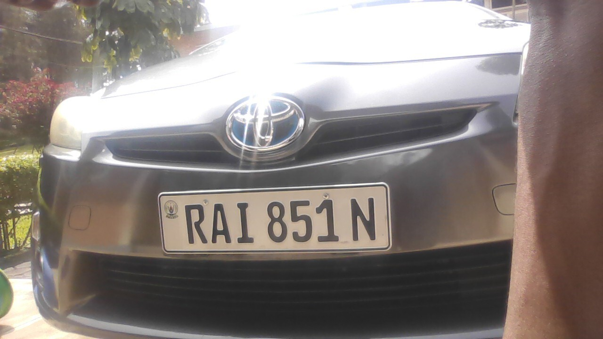
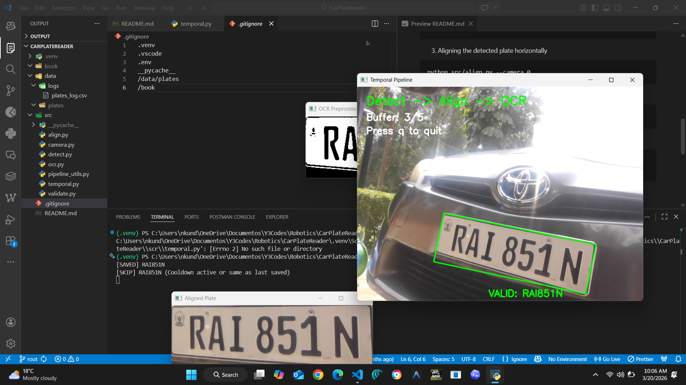

# Automatic Number Plate Recognition (ANPR) Project

This project implements a complete license plate recognition pipeline in Python. It captures frames from a webcam, detects and aligns license plates, extracts text using Tesseract OCR, validates the format, and maintains a history to confirm plates after multiple observations.

## The Pipeline

The system works in the following sequential steps:

1. **Capture**: Opens the default webcam (or external camera) to capture live video frames.
2. **Detection (`src/detect.py`)**: Converts frames to grayscale, applies bilateral filtering for noise reduction, uses Canny edge detection, and finds contours. It looks for rectangular contours (4 points) that approximate a license plate shape.
3. **Alignment (`src/align.py`)**: Uses a perspective transform (`cv2.warpPerspective`) based on the 4 corners of the detected contour to correct the perspective and create a flat, frontal view of the plate.
4. **OCR Extraction (`src/ocr.py`)**: The aligned image is thresholded and passed into Tesseract OCR (`pytesseract`) configured to expect a single line of alphanumeric characters (`--psm 7`).
5. **Validation (`src/validate.py`)**: The extracted text is cleaned of non-alphanumeric characters. It uses rules (e.g., length between 5 and 8 characters, containing both letters and numbers) to validate that it represents a real plate.
6. **Confirmation & Saving (`src/main.py`)**: A valid plate text must be seen identically across multiple frames (default 5 observations) before it is confirmed. Once confirmed, it is saved with a timestamp to `data/plates.csv`. Upon the first confirmed plate, screenshots are captured automatically for demonstration purposes.

## Installation Instructions

1. **Prerequisites**: Python 3.8+ must be installed on your system.
2. **Install Tesseract OCR**:
   - For Windows: Download the installer from the [UB-Mannheim repository](https://github.com/UB-Mannheim/tesseract/wiki) and install it. Ensure the installation path (typically `C:\Program Files\Tesseract-OCR\tesseract.exe`) is added to your system's PATH variable, or adjust the code in `src/ocr.py` to point to it explicitly: `pytesseract.pytesseract.tesseract_cmd = r'C:\Program Files\Tesseract-OCR\tesseract.exe'`.
   - For Linux: `sudo apt-get install tesseract-ocr`
   - For macOS: `brew install tesseract`
3. **Install Python Dependencies**:
   Navigate to the project directory and run:
   ```bash
   pip install -r requirements.txt
   ```

## Usage

1. Run the main processing script from the `anpr-project` root:
   ```bash
   python src/main.py
   ```
2. Point your webcam at a printed license plate, a phone screen showing a plate, or an actual vehicle.
3. The system will process frames in real-time. Once it spots a plate and confirms it 5 times:
   - The result is printed in the terminal.
   - The record is appended to `data/plates.csv`.
   - Screenshots are saved to the `screenshots/` directory.

## Results Demonstration

When the system confirms its first plate, it will automatically save the following screenshots showcasing its capabilities. You MUST test the system yourself to generate these images.

### 1. Plate Detection
The green bounding box highlights the localized, detected license plate contour.


### 2. Plate Alignment
The cropped and perspective-corrected plate, ready for OCR processing.


### 3. OCR Result
The OCR's string output, read directly from the aligned plate.

